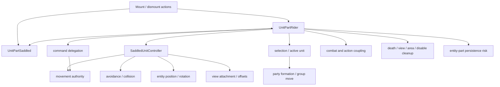
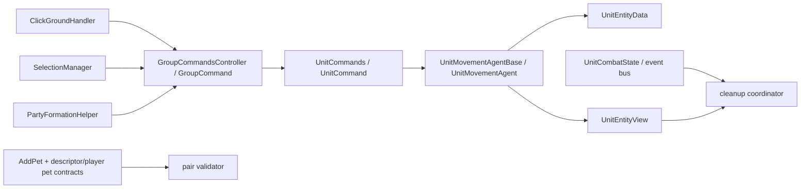

# Mounted subsystem dependency graph

Status: IN PROGRESS

The solid Wrath nodes below are exact local types. Dashed labels describe responsibilities still being traced. Kingmaker has no direct rider/saddled/controller types; its candidate seams are older movement, command, selection, formation, entity/view, and lifecycle primitives.

## Kingmaker candidate seam graph

## Required trace closure

| Concern | Wrath closure | Kingmaker closure | Status |
|---|---|---|---|
| Relationship state | Exact part fields/transitions/callers | Original runtime-only domain | IN PROGRESS |
| Command delegation | Rider helper and command call sites | Narrow routing decision and guard | IN PROGRESS |
| Movement authority | Controller-to-agent behavior | One enabled authoritative mover | IN PROGRESS |
| Avoidance/collision | Mounted flag/agent behavior | Reversible scoped override | IN PROGRESS |
| Entity position | Rider and mount entity semantics | Minimum logical synchronization | IN PROGRESS |
| View attachment | Offset/anchor lifecycle | Native transform anchor or bounded offset | IN PROGRESS |
| Selection | Mounted selection redirection | Stable restoration | IN PROGRESS |
| Formation | Mounted pair slot semantics | Single effective party mover | IN PROGRESS |
| Combat/action coupling | Future contract only | Phase 1 cleanup boundary | IN PROGRESS |
| Serialization | Part/reference persistence | No custom serialization in Phase 1 | IN PROGRESS |
| Lifecycle cleanup | All invalidation sources | Idempotent coordinator hooks | IN PROGRESS |
