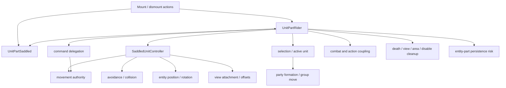
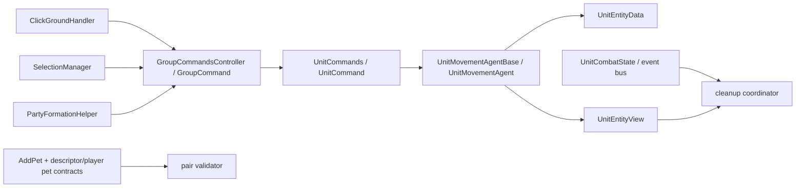
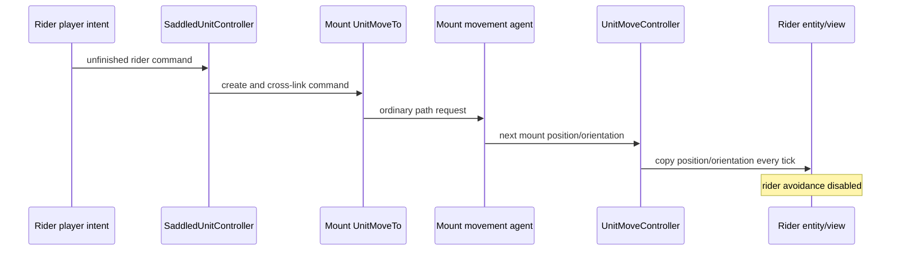

# Mounted subsystem dependency graph

Status: PASS

Exact Phase 1 responsibility/dependency coverage is complete. Bounded movement and cleanup edges qualified at runtime; doorway, selection, and formation remain fixture-limited.

The solid Wrath nodes below are exact local types. Kingmaker has no direct rider/saddled/controller types; its candidate seams are older movement, command, selection, formation, entity/view, and lifecycle primitives. Runtime qualification and exact claim limits are summarized after the graph.

## Kingmaker candidate seam graph

## Exact movement sequence

This is exact Wrath behavior. Kingmaker has every primitive except relationship state, command pairing, and the final pair-sync block.

## Required trace closure

| Concern | Wrath closure | Kingmaker closure | Status |
|---|---|---|---|
| Relationship state | Exact serialized reciprocal parts and repair traced | Original runtime-only domain | PASS |
| Command delegation | Bidirectional paired commands and rider approach suppression traced | Origin-level movement router; no combat pairs | PASS |
| Movement authority | Mount ordinary agent and movement-controller sync traced | One enabled authoritative mount mover | PASS |
| Avoidance/collision | Rider guard and other-agent exclusion traced | Reversible rider-only guard | PASS |
| Entity position | Per-tick mount-to-rider copy traced | Isolated active-pair synchronization | PASS |
| View attachment | Wrath root/IK lifecycle traced | Exact Mammoth `Spine` attachment is mechanically viable; a seated pose/animation is absent | PASS |
| Selection | Click/box redirection traced | Contract is mapped; mandatory away/back runtime row lacks an eligible non-pair fixture unit | DEFER — EVIDENCED |
| Formation | Mount exclusion and rider offset mirroring traced | Contract is mapped; mandatory non-pair group runtime row lacks an eligible third controllable unit | DEFER — EVIDENCED |
| Combat/action coupling | Target redirection and paired turn state traced | Phase 1 cleanup boundary only | PASS |
| Serialization | Reciprocal parts/position/command/turn persistence and repair traced | No custom serialization; direct pre-save cleanup qualified, without stock `SaveRoutine`/serialization exercise | PASS |
| Lifecycle cleanup | Wrath invalidations and Kingmaker events traced | Event-driven plus defensive invariant cleanup; direct lifecycle and bounded load/area cleanup qualified | PASS |

## Patch-surface decision

No global replacement of `UnitMoveController.Tick`, `UnitCommand.TickApproaching`, `UnitCommands.Run`, selection methods, formation helper, or save routines is justified. The bounded slice may use:

1. one project-owned rider `AgentOverride` plus a pair-local `LateUpdate` component; both touch only the active rider;
2. a prefix on exact private `ClickGroundHandler.RunCommand` token `0x060093DC` that rewrites/skips only active-pair arguments;
3. pair-scoped selection and Stop/Hold forwarding with identity guards;
4. existing event-bus interfaces for cleanup, plus cleanup-only save/load and continuous-control guards, qualified only within the direct-handler/service and real-load/real-reload scopes recorded below;
5. UMM lifecycle callbacks for composition-root cleanup.

This keeps non-mounted paths on their original code.

## Frozen runtime and architecture disposition

- Movement A/B passes: open ground, stop/start, turns/corners, pause/unpause, and destination cancellation. The mount remains the sole authoritative mover; tested synchronization, cleanup, and external restoration are exact.
- Lifecycle A/B passes in direct service/handler scope. Boundary rows pass 259/0 assertions across turn-based, realtime, save, load, and area. Turn-based/realtime do not prove native event delivery; save does not exercise stock `SaveRoutine` or serialization; load performs real exact-Working `Game.LoadGame` and observes the native `LoadRoutine` prefix without a UI request; area performs direct pre-cleanup plus real `ReloadArea` without independently qualifying native area-event delivery.
- Doorway is `DEFER — EVIDENCED` because the available valid route becomes hostile. Selection and formation are `DEFER — EVIDENCED` because no eligible directly controllable non-pair exists in the fixture. Overall: 22 PASS, 0 attributable FAIL, 3 deferred.
- Presentation is `MECHANICALLY VIABLE, NEW ANIMATION/POSE WORK REQUIRED`. No K1–K12 kill criterion fired, and no K13 exists. Scores remain A/B/C/D = 41/66/77/89; Architecture B remains provisional.
- Final status is `BLOCKED — CRITICAL`: the graph and tested seams support Architecture B, but the missing mandatory fixture-backed doorway, selection, and formation proofs prevent Proceed and do not establish Pivot. Phase 2 is not authorized.
