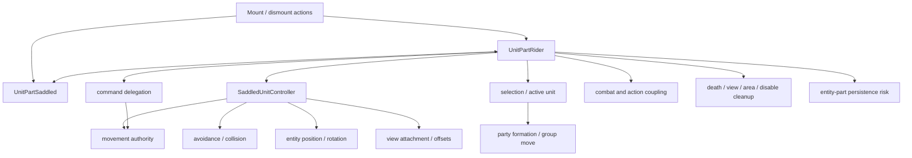
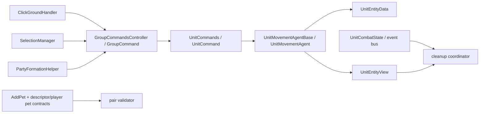
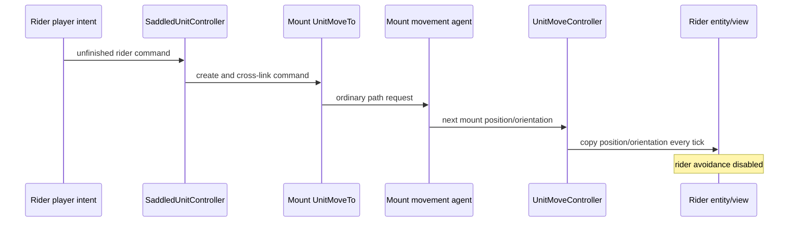

# Mounted subsystem dependency graph

Status: PASS for exact Phase 1 responsibility/dependency coverage; runtime edges remain unqualified.

The solid Wrath nodes below are exact local types. Dashed labels describe responsibilities still being traced. Kingmaker has no direct rider/saddled/controller types; its candidate seams are older movement, command, selection, formation, entity/view, and lifecycle primitives.

## Kingmaker candidate seam graph

## Exact movement sequence

This is exact Wrath behavior. Kingmaker has every primitive except relationship state, command pairing, and the final pair-sync block.

## Required trace closure

| Concern | Wrath closure | Kingmaker closure | Status |
|---|---|---|---|
| Relationship state | Exact serialized reciprocal parts and repair traced | Original runtime-only domain | PASS |
| Command delegation | Bidirectional paired commands and rider approach suppression traced | Origin-level movement router; no combat pairs | PASS |
| Movement authority | Mount ordinary agent and movement-controller sync traced | One enabled authoritative mount mover | PASS |
| Avoidance/collision | Rider guard and other-agent exclusion traced | Reversible rider-only guard | PASS |
| Entity position | Per-tick mount-to-rider copy traced | Isolated active-pair synchronization | PASS |
| View attachment | Wrath root/IK lifecycle traced | Exact Mammoth `Spine` transform supports a bounded anchor-transform experiment; pose/stability remains runtime-only | IN PROGRESS |
| Selection | Click/box redirection traced | Snapshot, rider selection, restore | PASS |
| Formation | Mount exclusion and rider offset mirroring traced | Effective-unit mapping | PASS |
| Combat/action coupling | Target redirection and paired turn state traced | Phase 1 cleanup boundary only | PASS |
| Serialization | Reciprocal parts/position/command/turn persistence and repair traced | No custom serialization; pre-save cleanup | PASS |
| Lifecycle cleanup | Wrath invalidations and Kingmaker events traced | Event-driven plus defensive invariant cleanup | PASS |

## Patch-surface decision

No global replacement of `UnitMoveController.Tick`, `UnitCommand.TickApproaching`, `UnitCommands.Run`, selection methods, formation helper, or save routines is justified. The bounded slice may use:

1. one project-owned rider `AgentOverride` plus a pair-local `LateUpdate` component; both touch only the active rider;
2. a prefix on exact private `ClickGroundHandler.RunCommand` token `0x060093DC` that rewrites/skips only active-pair arguments;
3. pair-scoped selection and Stop/Hold forwarding with identity guards;
4. existing event-bus interfaces for cleanup, plus cleanup-only save/load and continuous-control guards whose timing must be runtime-qualified;
5. UMM lifecycle callbacks for composition-root cleanup.

This keeps non-mounted paths on their original code.
